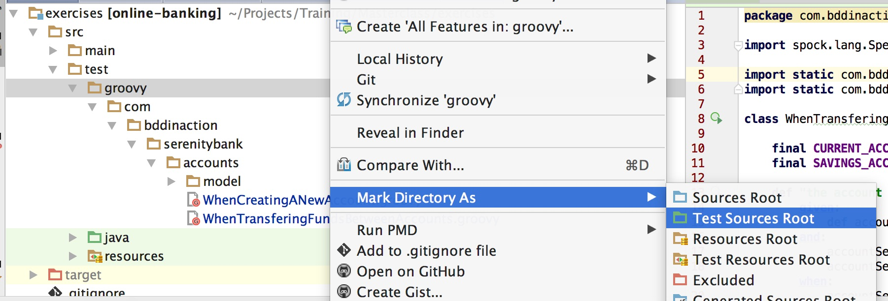
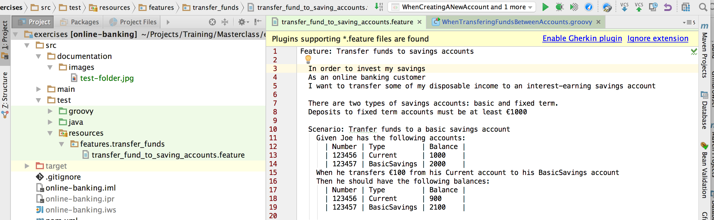

#
 BDD In Action Online Banking Sample Project

This sample project is used as part of the [BDD/TDD Masterclass](https://johnfergusonsmart.com/programs-courses/bdd-tdd-clean-coding/) run by [John Ferguson Smart](https://johnfergusonsmart.com/programs-courses/bdd-tdd-clean-coding/). It is a simple application that simulates the core of an online banking system. 


The project uses [Maven 3](https://maven.apache.org), Java 8, [Cucumber JVM](https://cucumber.io/) and [Spock](http://spockframework.org/). You will only need to install Java 8 and Maven 3 - the other dependencies will be downloaded as part of the build process. You will also need Git and a GitHub account, both to clone the repository and to navigate between different exercises. If you are new to Git and GitHub, we recommend the [Github Desktop application](https://desktop.github.com).


To get started, clone this project either from the command line or via your Git client:
```
git clone git@github.com:wakaleo/serenity-bank.git
```

If you have Maven installed on the command line, you can run the following command in the `serenity-bank` directory:
```
mvn install
```

This will run all of the tests as part of the build. To run the tests individually, just run `mvn verify`. This will generate a Serenity BDD report in the `target/site/serenity` directory.

Now import the project into your favorite IDE. We recommend [IntelliJ Idea](https://www.jetbrains.com/idea/) because of it's excellent built-in Groovy and Cucumber support. If you are using Intellij, follow the following instructions to get the best user experience for this project.

Import the project using `File...New...Project from Existing Sources...` and select the `serenity-bank` folder. Choose `Import from Existing Model`, and select Maven. Then step through the instructions to create the project in IntelliJ. It may take some time the first time to import the Maven dependencies.

Once the project is imported, open the `src/test` folder and mark the `groovy` directory as a Test Root directory:



To benefit from the full IntelliJ support for Cucumber, you will need to open a feature file like the one shown here and click on the link to Install or Enable the Gherkin plugin:



Each branch of the project represents an exercise that is done as part of the workshop. 
